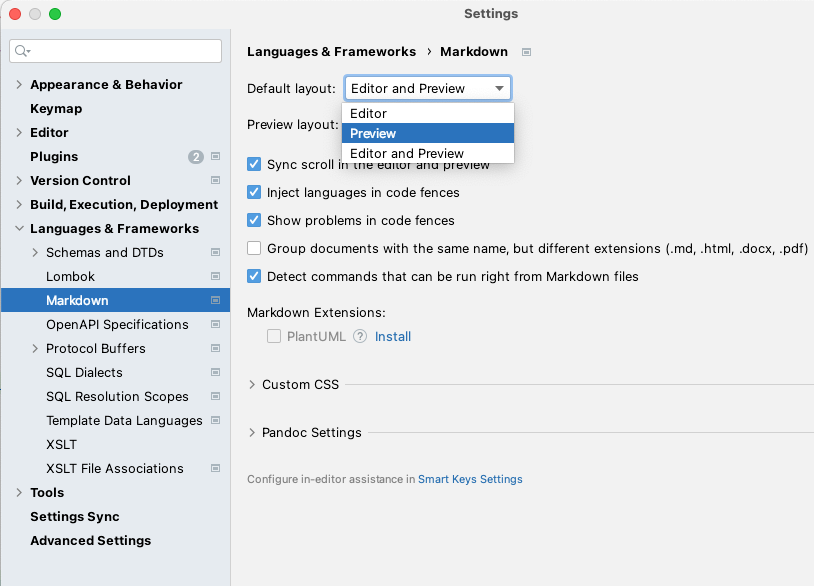

# Apache Flink Bootcamp Exercises

Exercises that accompany the training content in the documentation.

## Table of Contents

[**Set up your development environment**](#set-up-your-development-environment)

1. [Software requirements](#software-requirements)
1. [Download and build the flink-training project](#download-and-build-the-flink-training-project)
1. [Import the flink-training project into your IDE](#import-the-flink-training-project-into-your-ide)

[**How to do the lab exercises**](#how-to-do-the-lab-exercises)

1. [Run and debug Flink programs in your IDE](#run-and-debug-flink-programs-in-your-ide)
1. [Exercises, tests, and solutions](#exercises-tests-and-solutions)

[**Lab exercises**](#lab-exercises)

## Set up your development environment

You will need to set up your environment in order to develop, debug, and execute solutions to 
the training exercises and examples.

### Software requirements

Flink supports Linux, OS X, and Windows as development environments for Flink programs and 
local execution. The following software is required for a Flink development setup and should 
be installed on your system:

- a JDK for Java 17 (a JRE is not sufficient; other versions of Java are currently not supported)
- an IDE for Java development with Gradle support
  - We recommend [IntelliJ](https://www.jetbrains.com/idea/), but [Eclipse](https://www.eclipse.org/downloads/) or 
    [Visual Studio Code](https://code.visualstudio.com/) (with the [Java extension pack](https://code.visualstudio.
    com/docs/java/java-tutorial)) can also be used so long as you stick to Java. 
  - The recent Eclipse comes with Java 21, make sure you configure the Gradle plugin to use Java 17.

> **:information_source: Note for Windows users:** The shell command examples provided in the training instructions are for UNIX systems.
> You may find it worthwhile to setup cygwin or WSL. For developing Flink jobs, Windows works reasonably well: you can run a Flink cluster on a single machine, submit jobs, run the webUI, and execute jobs in the IDE.

### Clone and build the flink-training-bootcamp project

The `ff-2024` branch in the `flink-training` repo in GitHub contains exercises, tests, and reference solutions for 
the programming exercises. To get started, you need to:

```bash
git clone https://github.com/kkrugler/flink-training
cd flink-training
git checkout ff-2024
./gradlew clean testSolutions
```

If this is your first time building it, you will end up downloading all the dependencies for this Flink training
project. This usually takes a few minutes, depending on the speed of your internet connection.

If all the tests pass and the build is successful, you are off to a good start.

### Import the flink-training-bootcamp project into your IDE

The project needs to be imported as a gradle project into your IDE.

Then you should be able to open [`BootcampWindowing1WorkflowTest`](bootcamp/windowing/src/test/java/com/ververica/flink/training/exercises/BootcampWindowing1WorkflowTest.java) 
and run this test.

> **:information_source: Note for Eclipse users:** Several Gradle projects in this repo 
> depend on the Gradle project `common`. In order for Eclipse to detect the Gradle project dependencies correctly:
> You likely need to run the following command:
> 
> `cd flink-training-bootcamp; ./gradlew cleanEclipse cleanEclipseProject cleanEclipseClasspath eclipse`
> 
> Then, in the Gradle project that depends on `common`, set `Without test code` to `No` in the project dependence 
> setting. See the screenshot: 
> 

### Improving your Markdown experience

When you open a Markdown file in IntelliJ, by default both the editor pane and the preview
pane are displayed. You can switch to only showing the preview mode by selecting "Settings..."
from the "IntelliJ IDEA" menu, then "Languages & Frameworks" > "Markdown". In the Markdown
settings, select "Preview" from the "Default Layout" popup menu.



### Flink JavaDoc

The Java documentation for Flink 1.19 is located [here](https://nightlies.apache.org/flink/flink-docs-release-1.19/api/java/)
You can ignore the `1.19-SNAPSHOT` version at the top of the main page, this documentation is for the
released version.

## How to do the lab exercises

In the labs, you will implement Flink programs using various Flink APIs.

The following steps guide you through the process of using the provided data streams, 
implementing your Flink streaming program, and executing your program in your IDE.

We assume you have set up your development environment according to our
[setup guide](#set-up-your-development-environment).

### Run and debug Flink programs in your IDE

Flink programs can be executed and debugged from within an IDE. This significantly eases the 
development process and provides an experience similar to working on any other Java application.

All of the `*Job` applications and `*WorkflowTest` JUnit
tests will start a local Flink instance (aka `FlinkMiniCluster`). Because all the code is 
running in one JVM that is started by your IDE, you can put breakpoints in your code for debugging.

Note that the local Flink instance will be serving Flink's Web UI at http://localhost:8081.
If port 8081 is blocked and Flink won't start, or if the Web UI is not showing up, you can also
configure and force the local mode via the `--local` program argument and set the port the
Web UI is listening on, via `--local <port>`.

The Flink instance will also be configured to use a `fixedDelayRestart` failure strategy with
15s delay and infinite restarts, which is helpful for debugging code.

You can also specify the parallelism via `--parallelism <number>` if needed. This is mostly
useful when understanding the impact of changing the job's parallelism. Note that if you
do not specify the parallelism, and you're running locally, the Flink instance will be started
with its total slots (and thus any job's maximum parallelism) set to the number of CPU cores
on your system.

If you have an IDE with this `flink-training-bootcamp` project imported, you can run 
(or debug) a streaming job by:

- opening the [BootcampExampleJob](bootcamp/example/src/main/java/com/ververica/flink/training/examples/BootcampExampleJob.java)
- running (or debugging) the `main()` method of this class

### The Flink WebUI

When you run a Flink program from the `*Job` class's `main()` method, you can then
point your browser at http://localhost:8081 to view the Flink Web UI.

For more details, please see the [example README](bootcamp/example/README.md) file.

### Exercises, tests, and solutions

Each of these exercises include:
- an `...Exercise` class with most of the necessary boilerplate code for getting started
- a JUnit Test class (`...Test`) with a few tests for your implementation
- a `...Solution` class with a complete solution.

If there are multiple exercises, the class name will be `...1Exercise`, `...2Exercise`, and so on.

You can run exercises, solutions, and tests with the `gradlew` command.

To run tests on all your exercise code:

```bash
./gradlew test
```

To run tests on just the exercises in one of the labs:

```bash
./gradlew :bootcamp:<subproject>:test
```

Now you are ready to begin the lab exercises listed below. There are links to each lab's
README file, which describes what you need to do, as well links to each lab's DISCUSSION
file, which talks about the solution(s).

## Lab exercises

1. [Stream analytics via windowing](bootcamp/windowing)
   - [Exercise](bootcamp/windowing/README.md)
   - [Discussion](bootcamp/windowing/DISCUSSION.md)
1. [Optimizing serialization](bootcamp/serialization)
   - [Exercise](bootcamp/serialization/README.md)
   - [Discussion](bootcamp/serialization/DISCUSSION.md)
1. [Exactly-once and failure handling](bootcamp/failures)
    - [Exercise](bootcamp/failures/README.md)
    - [Discussion](bootcamp/failures/DISCUSSION.md)
1. [Enrichment and scalability](bootcamp/enrichment)
    - [Exercise](bootcamp/enrichment/README.md)
    - [Discussion](bootcamp/enrichment/DISCUSSION.md)
1. [Flink SQL and Table API](bootcamp/tables)
    - [Exercise](bootcamp/tables/README.md)
    - [Discussion](bootcamp/tables/DISCUSSION.md)
1. [Workflow design and Paimon](bootcamp/design)
    - [Exercise](bootcamp/design/README.md)
    - [Discussion](bootcamp/design/DISCUSSION.md)
