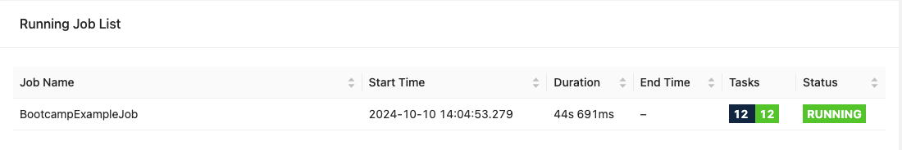
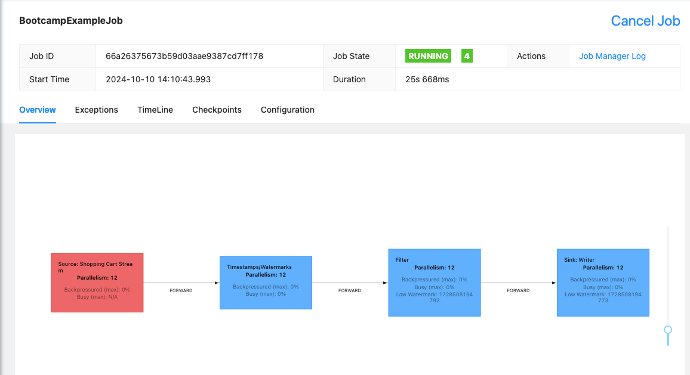
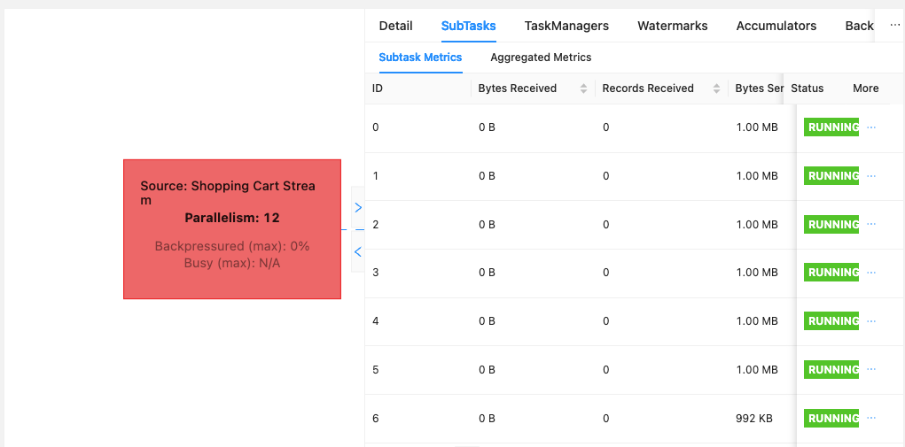
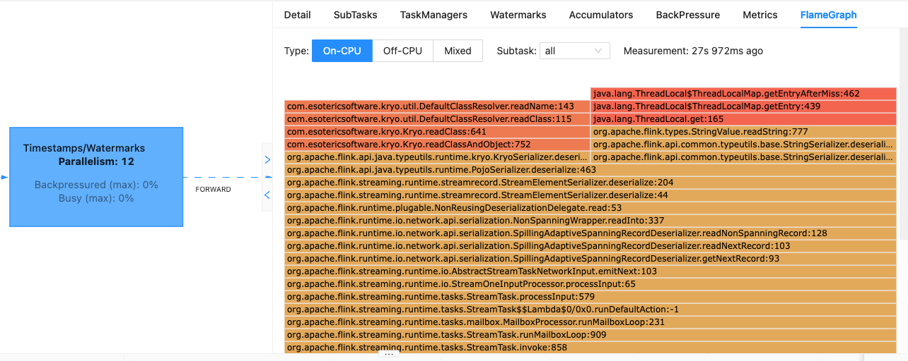

# Example Workflow

## Introduction

This subproject is part of the "Apache Flink Bootcamp" training by Ververica. 
Please follow the [Setup Instructions](../../README-Bootcamp.md#set-up-your-development-environment) first
and then continue reading here.

### The Flink Job

This simple Flink job reads eCommerce shopping cart activity data from a testing source that generates
fake records. Records are filtered to only completed transactions, and then
written to a sink.

### The Flink WebUI

When you run a Flink program from the `*Job` class's `main()` method, you can then
point your browser at http://localhost:8081 to view the Flink Web UI.

When you click on the row under "Job Name", you'll see your job's execution graph, along
with lots of additional information.

If you click on a specific operator, you'll see information about that operator.

You can view per-subtask information about the amount of data being received/sent, etc.
Note that sources will always have 0 `Bytes Received` or `Records Received`, and sinks will
always have 0 `Bytes Sent` or `Records Sent`.

If you scroll to the right in this view, you'll see the `Flamegraph` item, which displays
profiling information in a graphical format. We'll be using this in the
[Serialization Lab](../serialization/README.md)

-----

[**Back to Bootcamp Overview**](../../README-Bootcamp.md)
