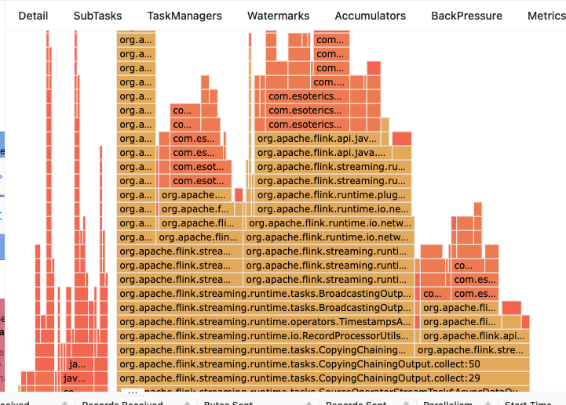

# Lab: Bootcamp Serialization (Discussion)

We'll work through the solutions to the exercises.

## Exercise 1 Solutions

See the [README](README.md#exercise-1) file for the steps.

Before starting any optimization work, it's always best to measure/profile. We can use
Flink's flamegraph to get an idea of where significant time (CPU cycles) is being
spent.



If you hover over various wide parts of the graph, you'll see that most of the time
is being spent doing serialization.


1. Create a `TrimmedShoppingCart` record that has **only** the fields from the
   `ShoppingCartRecord` that are used by the workflow, and convert from the incoming
   `ShoppingCartRecord` to this `TrimmedShoppingCart` as soon as possible.
   ```java
   public class TrimmedShoppingCart {
       private String transactionId;
       private String country;
       private boolean transactionCompleted;
       private long transactionTime;
       private List<CartItem> items;

       public TrimmedShoppingCart() { }
   ```
1. Make sure this `TrimmedShoppingCart` is serializable as a POJO.
   ```java
        @TypeInfo(ListInfoFactory.class)
        private List<CartItem> items;
   ```
   You can verify this via:
   ```java
   PojoTestUtils.assertSerializedAsPojoWithoutKryo(TrimmedShoppingCart.class);
   ```
1. Modify the `ShoppingCartRecord` (in the common sub-project) to also use the `@TypeInfo` annotation.

## Exercise 2 Solutions

See the [README](README.md#exercise-2) file for the steps.

1. Use a simple structure for top two durations, versus a `PriorityQueue`.
   We can change the aggregator function to use a specific type (`LongestTwoTransactions`)
   instead of a `PriorityQueue`, which can't be serialized by Flink's POJO support.
   ```java
    private static class FindLongestTransactions implements AggregateFunction<Tuple2<String, Long>,
            LongestTwoTransactions, List<Tuple2<String, Long>>> {
        @Override
        public LongestTwoTransactions createAccumulator() {
            return new LongestTwoTransactions();
        }

        @Override
        public LongestTwoTransactions add(Tuple2<String, Long> value, LongestTwoTransactions acc) {
            acc.add(value);
            return acc;
        }

        @Override
        public List<Tuple2<String, Long>> getResult(LongestTwoTransactions acc) {
            List<Tuple2<String, Long>> result = new ArrayList<>();
            result.add(acc.getFirst());
            if (acc.getSecond() != null) {
                result.add(acc.getSecond());
            }

            return result;
        }

        @Override
        public LongestTwoTransactions merge(LongestTwoTransactions a, LongestTwoTransactions b) {
            if (b.getFirst() != null) {
                a.add(b.getFirst());

                if (b.getSecond() != null) {
                    a.add(b.getSecond());
                }
            }

            return a;
        }
    }
   ```

2. Use a KeyedProcessFunction to find transaction durations, versus Flink's session window
   support. As mentioned in the README, this is much harder than you might think, due to
   timers that you need to create to ensure you generate results after enough time has gone
   by to assume the function has received all the transactions for a given session.

   We'll need to create a `KeyedProcessFunction`, which processes `TrimmedShoppingCart`
   records, and updates state for the earliest uncompleted transaction, the completed
   transaction, and any timer that we've set (we need this to remove an existing timer,
   when we want to change the expiration time).
   ```java
       private static class FindTransactionBoundsFunction extends KeyedProcessFunction<String, TrimmedShoppingCart, Tuple2<String, Long>> {

        // Earliest time of any uncompleted transaction
        private ValueState<Long> earliestTime;
        // Set if we have a timer running
        private ValueState<Long> timerTime;
        // Transaction time for the one completed transaction
        private ValueState<Long> endTime;

        @Override
        public void open(OpenContext openContext) throws Exception {
            earliestTime = getRuntimeContext().getState(new ValueStateDescriptor<>("earliestTime", Long.class));
            timerTime = getRuntimeContext().getState(new ValueStateDescriptor<>("timerTime", Long.class));
            endTime = getRuntimeContext().getState(new ValueStateDescriptor<>("endTime", Long.class));
        }

        @Override
        public void processElement(TrimmedShoppingCart in, Context ctx, Collector<Tuple2<String, Long>> out) throws Exception {
            Long earliest = earliestTime.value();
            Long timer = timerTime.value();
            Long end = endTime.value();
            
            long transactionTime = in.getTransactionTime();

            // We assume properly ordered data, in that the completed transaction's time will always be >= any
            // uncompleted transactions, thus we don't need to do any special checks here.
            if (in.isTransactionCompleted()) {
                removeTimer(ctx);
                endTime.update(transactionTime);
                timerTime.update(transactionTime);
                startTimer(ctx);
            } else {
                if ((earliest == null) || (earliest > transactionTime)) {
                    earliestTime.update(transactionTime);
                }

                // See if we need to update the timerTime. If we have an end time
                // then we are good, otherwise if this is the first non-transaction
                // record, or it's later than our current timer, we want to stop the 
                // potentially running timer, and start with the later time.
                if ((end == null) && ((earliest == null) || (transactionTime > timer))) {
                    removeTimer(ctx);
                    timerTime.update(transactionTime);
                    startTimer(ctx);
                }
            }
        }

        private void startTimer(Context ctx) throws IOException {
            ctx.timerService().registerEventTimeTimer(timerTime.value() + MAX_SESSION_GAP_MS);
        }

        private void removeTimer(Context ctx) throws IOException {
            if (timerTime.value() != null) {
                ctx.timerService().deleteEventTimeTimer(timerTime.value() + MAX_SESSION_GAP_MS);
                timerTime.clear();
            }
        }

        @Override
        public void onTimer(long timestamp, OnTimerContext ctx, Collector<Tuple2<String, Long>> out) throws Exception {
            // Timer fired. If we have an end transaction, then we have a duration. If there's no start, assume it's
            // a single action. If we don't have an end transaction, assume it's an abandoned cart (do nothing).
            Long start = earliestTime.value();
            Long end = endTime.value();
            if (end != null) {
                if (start == null) {
                    start = end;
                }

                // If we just call out.collect(), the record's event time is set to the timer's timestamp. But
                // that's not what we want, as this timer is for when we "close" a session, so it's some time
                // after the end of the session. We need to do the funky cast of the collector to a TimestampedCollector,
                // which lets us set the timestamp to use when we call collect.
                TimestampedCollector<Tuple2<String, Long>> outWithTime = (TimestampedCollector)out;
                outWithTime.setAbsoluteTimestamp(end);
                outWithTime.collect(Tuple2.of(ctx.getCurrentKey(), end - start));
            }

            // Clear all our state
            earliestTime.clear();
            timerTime.clear();
            endTime.clear();
        }
    }
   ```

-----

[**Back to Bootcamp Overview**](../../README-Bootcamp.md)
