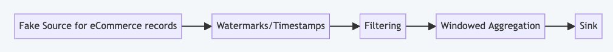

# Lab: Bootcamp Windowing

## Introduction

This lab is the hands-on part of the "Apache Flink Bootcamp" training by Ververica. 
Please follow the [Setup Instructions](../../README-Bootcamp.md#set-up-your-development-environment) first
and then continue reading here.

### The Flink Job

This simple Flink job reads eCommerce shopping cart activity data from a testing source that generates
fake records. Records are filtered to only completed transactions, then grouped by country, divided
into tumbling one-minute windows, and then a count of total items in each cart is calculated.
The overall flow is depicted below:

## Exercise 1

Modify the [BootcampWindowing1Workflow](src/main/java/com/ververica/flink/training/exercises/BootcampWindowing1Workflow.java)
class to:

- Generate a `KeyedWindowResult` record, where the key is the country, the time is
  the start of the window, and the count is the number of items.
- Start by adding watermarks to the `cartStream`, using the `.assignTimestampsAndWatermarks()` method with
  the `WatermarkStrategy` returned by the appropriate `WatermarkStrategy.<ShoppingCartRecord>` static helper
  method. Hint - you want bounded out-of-orderness.
- Then filter out any `ShoppingCartRecord` that is not a completed transaction, via a
   Flink FilterFunction and the `ShoppingCartRecord.isTransactionCompleted()` method.
   Note you can use Java lambdas to easily implement simple filters like this.
 - Key the resulting stream by the record's country, then window the stream into
   tumbling (**not** sliding) windows of 1 minute.
- Call `DataStream.aggregate()` with a Flink `AggregationFunction` and a
  `ProcessWindowFunction` to calculate the total number of cart items for
  all the records found in each 1-minute/country window. You can use the [CountCartItemsAggregator](src/main/java/com/ververica/flink/training/exercises/CountCartItemsAggregator.java) 
  class as the starting point for the aggregator, and the `SetKeyAndTimeFuntion` as-is for the `ProcessWindowFunction`.

To test, run the [BootcampWindowing1WorkflowTest](src/main/java/com/ververica/flink/training/exercises/BootcampWindowing1WorkflowTest.java)
in IntelliJ.

If you get stuck, classes for a working solution are located in the [provided](src/main/provided/com/ververica/flink/training/solutions/) directory.

## Exercise 2

Extend your solution to the first exercise, or modify the [BootcampWindowing2Workflow](src/main/java/com/ververica/flink/training/exercises/BootcampWindowing2Workflow.java)
class to calculate an additional result for completed transactions:

- Generate a `WindowAllResult`, where the time is the start of
  the window, and the result is a count.
- This result is based on a tumbling 5-minute window, for all countries. This
  means you don't key the stream, and you have to use the `.windowAll()` method
  in `DataStream`.
- Key the resulting stream by the record's country, then window the stream into
  tumbling (not sliding) windows of 1 minute.
- Call `DataStream.aggregate()` with a Flink `AggregationFunction` and a
  `ProcessWindowFunction` to calculate the total number of cart items for 
  all the records found in each 5-minute window (across all countries).

To test, run the [BootcampWindowing2WorkflowTest](src/main/java/com/ververica/flink/training/exercises/BootcampWindowing2WorkflowTest.java)
in IntelliJ.

## Exercise 3

Extend your solution to the second exercise, or modify the [BootcampWindowing3Workflow](src/main/java/com/ververica/flink/training/exercises/BootcampWindowing3Workflow.java)
class to calculate an additional result, which is the two longest transactions per
a configurable window (defaults to 5 minutes). By "longest transaction" we mean a 
transaction's duration, calculated as delta from the completed record to the
first record. The resulting KeyedWindowResult uses the transactionId as the key,
the window start time as the time, and the duration (in milliseconds) as the value.

This one is tricky, as you'll first need to find transaction duration by:

 - key by each (unfiltered) shopping cart record's transactionId.
 - Use Flink's `EventTimeSessionWindows` support for sessions. I'd suggest a
   1 minute maximum gap between records to define a session.
 - Use `.aggregate` to track the min/max times, to find the bounds of a session.
 - Then do a `.windowAll`, and find the top 2 transactions (by duration).

If you get stuck, the `BootcampWindowingSolution3Workflow` implements a working version.

-----

[**Back to Bootcamp Overview**](../../README-bootcamp.md)
